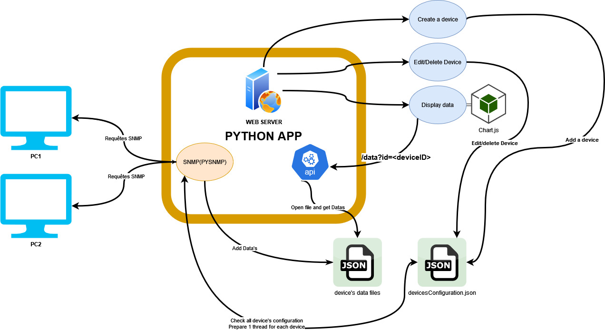

# Développement d'un logiciel de supervision

Dans le cadre de notre projet, il nous a été demandé de développer une application nous permettant de récupérer le nombre d'octets entrants/sortant d'une interface d'une ou plusieurs machines.
Au sein de ce readme vous trouverez essentiellement:
* Comment nous nous sommes organisés et pourquoi
* Un résumé technique de notre application

## Partie organisationnelle

### Résumé général de l'application
Avant de nous lancer dans le développement à proprement parlé, il nous a été recommandé de réfléchir précisément à l'application que nous voulions développer. Au cours de cette phase nous devions: 
* Imaginer un projet concret
* Réfléchir à tout ce qu'engendre ce projet en terme de technicité

Nous vous proposons ici une description des fonctionnalités que doit être capable de fournir notre programme.

Notre application sera un site web, depuis lequel nous pourrons:
* Consulter l(les)'interface de chacun des appareils que nous avons choisi de monitorer. Nous entendons ici: observer le flux entrant et sortant d'une interface selon le temps.
* Pouvoir ajouter/supprimer un appareil à monitorer depuis l'interface web
* Récupération des logs de l'appareil(à définir)
* Voir si une machine est en ligne ou non
* Selon l'utilisateur avec lequel nous nous connectons, différentes possibilités se présenteront


### Choix des technologies

Vous trouverez ci-dessous le choix justifié de nos technologies:

#### Page web
Nous utiliserons flask qui est une librairie de python. Il en existe d'autre mais c'est la technologie que nous maitrisons le mieux pour le web.

#### SNMP
Nous utiliserons pysnmp qui est une librarie python permettant de faire des requêtes SNMP vers des clients. Bien qu'il en existe d'autres en python, cette technologie semble être la plus documentée.

#### Affichage des données
Pour l'instant nous choisissons JS chart qui est une librarie javascript permettant d'afficher divers types de graphique en temps réel.

#### Stockage des données
Etant donnée que ce projet n'est pas d'une "grande" complexité en termes des données à enregistrer, nous avons décidé de stocker les données sous le format json suivant.

```json
    "1": {
        "timestamp": 1728318841,
        "ifHcOctetsin": 762889,
        "ifHcOctetsOut": 424413
        .... Autres données disponibles.....
    }
```
Ci-dessus, nous pouvons observer un exemple de données sauvegardés. En fonction de nos besoins il sera assez facile des OIDS.

#### Logs
Les logs seront le résultat de différentes fonctions Javascript/Python exécutées sur les données de supervision collectés. Les logs seront ensuite stockés dans différents fichiers JSON représentant le contenu complets des logs de chaque machine. Les logs de connections du serveur web pourront être ajoutés au projet si le temps nous le permet.

## Fonctionnement de l'application
L'application pourra se découper en 4 grandes parties.
* Le site WEB
* Le SNMP
* Les fichiers de Configuration
* L'affichage des données 

Nous vous proposons dans un premier temps un schéma résumant notre application:



Au sein du code, nous distinguerons 3 grandes parties.
* SNMP(PYSNMP) se chargera de requêter les oids configurés pour chacune des machines. Ces Oids sont configurés sous forme de tableau JSON. Chaque machine peut avoir des oids particuliers
* L'api renvoie les données récoltées par la partie SNMP de notre programme en fonction du numéro de machine requêté.
* Le serveur web fait simplement office de vitrine pour
    * L'affichage des résultats
    * La gestion (ajout, modification, suppression) du parc de machines 

### Notre avancement au 13/10
* Nous sommes capables d'ajouter une machine avec plusieurs OIDS. 
* Les requêtes SNMP sont fonctionnelles, nous sommes capable de stocker durablement les données dans des fichiers json et ce, pour plusieurs machines.
* L'ajout formaté en json de chaque endpoint est fonctionnel
* Le site web est partiellement fonctionnel(On ne peut qu'ajouter/consulter la liste des devices)
* Faire en sorte que quand nous ajoutons une machine depuis le site web, que cette machine soit prise en compte dans la "boucle SNMP". Pour l'instant il faut redémarrer le programme. (~30 minutes)
* Persistance des données. Les données SNMP sont supprimées à chaque nouveau démarrage de l'application 


### Ce qu'il nous reste à faire au 13/10:
* Afficher les données sous forme de graphique.
* Modification des devices depuis le site
* Suppression des devices depuis le site
* Mettre le système de disponibilité sur chaque machine (~30 minutes)
* Rendre la création de nouveau thred automatique. Les machines ajoutées par l'interface web doivent actuellement être ajouté en dur à la liste des machines à requêter. (~30 minutes)
* Persistance des données à réaliser. Les données SNMP sont supprimées à chaque nouveau démarrage de l'application (~40 minutes)
* Implémenter un système d'utilisateur sur notre site
    * Un administrateur
    * Un technicien

### Notre avancement au 21/10
En plus des fonctionnalités citées à la date précédentes : 
* Nous pouvons afficher des données sous la forme d'un graphique
* Persistance des données en place. Les données SNMP stockés durant les précdentes executions ne sont plus supprimées à chaque nouveau démarrage de l'application.
* Rendre la création de nouveau thred automatique terminé. Les machines ajoutées par l'interface web sont désormais automatiquement ajoutées à la liste des machines à requêter.

### Ce qu'il nous reste à faire le 21/10:
* Faire varier automatiquement l'affichage des données en fonction des oids supervisés des différentes machines. Actuellement, le serveur web cherchent toujours à afficher les même oids peu importe la  machine séléctionné.
* Modification des devices depuis le site
* Suppression des devices depuis le site
* Déployer le système de connectivité sur chaque machine (~30 minutes)
* Implémenter un système d'utilisateur sur notre site
    * Un administrateur
    * Un technicien

### Conclusion temporaire
Les bases de notre solutions sont désromais déployer concernant les parties de récupération, de stockage et d'affichage des données.
Quelques petits détails sont à apporter afin de rendre l'expérience utilisateur agréable. 
Dans l'ensemble, unebonne partie du travail a déjà été réalisée, nous pensons donc pêre dans les temps vis-à-vis délais qui nous sont imposés.

Au sein du code, nous distinguerons 3 grandes parties.
* SNMP(PYSNMP) se chargera de requêter les oids configurés pour chacune des machines. Ces Oids sont configurés sous forme de tableau JSON. Chaque machine peut avoir des oids particuliers
* L'api renvoie les données récoltées par la partie SNMP de notre programme en fonction du numéro de machine requêté.
* Le serveur web fait simplement office de vitrine pour
    * L'affichage des résultats
    * La gestion (ajout, modification, suppression) du parc de machines 

### Notre avancement au 13/10
* Nous sommes capables d'ajouter une machine avec plusieurs OIDS. 
* Les requêtes SNMP sont fonctionnelles, nous sommes capable de stocker durablement les données dans des fichiers json et ce, pour plusieurs machines.
* L'ajout formaté en json de chaque endpoint est fonctionnel
* Le site web est partiellement fonctionnel(On ne peut qu'ajouter/consulter la liste des devices)
* Faire en sorte que quand nous ajoutons une machine depuis le site web, que cette machine soit prise en compte dans la "boucle SNMP". Pour l'instant il faut redémarrer le programme. (~30 minutes)
* Persistance des données. Les données SNMP sont supprimées à chaque nouveau démarrage de l'application 


### Ce qu'il nous reste à faire au 13/10:
* Afficher les données sous forme de graphique.
* Modification des devices depuis le site
* Suppression des devices depuis le site
* Mettre le système de disponibilité sur chaque machine (~30 minutes)
* Rendre la création de nouveau thred automatique. Les machines ajoutées par l'interface web doivent actuellement être ajouté en dur à la liste des machines à requêter. (~30 minutes)
* Persistance des données à réaliser. Les données SNMP sont supprimées à chaque nouveau démarrage de l'application (~40 minutes)
* Implémenter un système d'utilisateur sur notre site
    * Un administrateur
    * Un technicien

### Notre avancement au 21/10
En plus des fonctionnalités citées à la date précédentes : 
* Nous pouvons afficher des données sous la forme d'un graphique
* Persistance des données en place. Les données SNMP stockés durant les précdentes executions ne sont plus supprimées à chaque nouveau démarrage de l'application.
* Rendre la création de nouveau thred automatique terminé. Les machines ajoutées par l'interface web sont désormais automatiquement ajoutées à la liste des machines à requêter.

### Ce qu'il nous reste à faire le 21/10:
* Faire varier automatiquement l'affichage des données en fonction des oids supervisés des différentes machines. Actuellement, le serveur web cherchent toujours à afficher les même oids peu importe la  machine séléctionné.
* Modification des devices depuis le site
* Suppression des devices depuis le site
* Déployer le système de connectivité sur chaque machine (~30 minutes)
* Implémenter un système d'utilisateur sur notre site
    * Un administrateur
    * Un technicien

### Conclusion temporaire
Les bases de notre solutions sont désromais déployer concernant les parties de récupération, de stockage et d'affichage des données.
Quelques petits détails sont à apporter afin de rendre l'expérience utilisateur agréable. 
Dans l'ensemble, unebonne partie du travail a déjà été réalisée, nous pensons donc pêre dans les temps vis-à-vis délais qui nous sont imposés.


